# Advancements in Hand Pose Estimation with a goal of automating Fugl-Meyer Assessment

> We explore 3 deep-learning based approaches to hand pose estimation and build a proof-of-concept RNN algorithm that uses hand pose estimation for an important application: Fugl-Meyer Assessment evaluation.

<!--more-->
{: class="table-of-content"}
* TOC
{:toc}

# Introduction

The Fugl-Meyer Assessment (FMA) is a scale used by physicians to assess sensorimotor impairment and recovery progress in individuals who have had stroke. The FMA tests upper extermity, lower extremity, sensory function, balance, and more. Traditionally, FMA tests have been evaluated by a physician, who assigns a score of 0, 1, or 2 per test depending on the subject’s ability. In recent years, researchers have investigated methods of automating FMA tests for more objective, data-driven results. These have often involved equipment such as inertial measurement units or force sensors attached on the patient’s limbs and fingers during the tests to collect data. However, the use of these sensors requires a significant effort on both the equiment designer and patient's side to set up monitoring equipment, physical attachment, and 3D modeling. For the specific class of FMA tests that evaluate hand movement, such as flexion or extension of fingers, we see potential in deep learning hand pose estimation methods to perform lightweight evaluation that requires only camera, has no restrictive equipment, and can be easily performed in many settings.

Hand pose estimation is the task of trying to predict the 3D spatial configuration of the human hand, which often is defined by joint positions and rotations, from visual data. This is a crucial problem in computer vision and has attracted attention due to its wide range of applications, which include human-computer interaction, virtual/augmented reality, sign language recognition, and robotics. Despite substantial progress, accurate and robust hand pose estimation remains challenging because of factors like occlusions and self-occlusions, complex hand articulations, low-resolution imaging, and variations in shape, size, and appearance.

In this article, we discuss three influential papers that have recently shaped the research landscape in hand pose estimation, common trends, and future predictions. We have a technical demo attempting to apply ths methods to an FMA test  via an RNN model.

---

# MediaPipe: A Framework for Building Perception Pipelines

## Motivation

MediaPipe addresses the challenges of building applications that perceive sensory data (like video and audio) and make inferences, such as object detection and pose estimation. These challenges include selecting and developing machine learning algorithms, balancing resource consumption with performance, and managing cross-platform compatibility. MediaPipe provides a modular, reusable framework for building perception pipelines, enabling developers to prototype, test, and deploy efficiently across platforms while maintaining reproducibility and performance.

## Methodology

MediaPipe's architecture centers on directed graph representations for perception pipelines, with specialized Calculators serving as processing nodes. These pipelines are formalized through GraphConfig protocol buffers and executed as Graph objects. The framework's data flow mechanism relies on temporally-ordered Packets traversing streams between nodes, with each Packet maintaining strict timestamp ordering and supporting arbitrary data types.

The graph architecture uses strategic placement and modification of Calculator nodes for incremental refinement. These nodes process both streaming data and side packets. The latter provide static configuration parameters like file paths and model coefficients. The calculator follows a simple, standardized design where you only need to define inputs, outputs, and key methods (Open, Process, Close).

MediaPipe's execution engine implements parallel processing strategies, isolating Calculator execution to individual threads while enabling concurrent processing where temporal dependencies permit. The framework enforces strict validation protocols, examining stream compatibility, node connections, and contract adherence prior to execution. Runtime errors trigger controlled shutdown sequences rather than catastrophic failures.

The architecture's emphasis on modularity extends to its support for subgraph encapsulation, enabling the abstraction of complex processing chains into reusable components. This architectural approach yields a framework capable of supporting sophisticated real-time perception tasks while maintaining cross-platform compatibility and computational efficiency.​​​​​​​​​​​​​​​​

## Performance Analysis

MediaPipe achieves exceptional performance and resource utilization through a sophisticated architectural approach. 

A key performance differentiator lies in MediaPipe's intelligent GPU memory management. By maintaining video frame data within GPU memory throughout processing chains, the framework significantly reduces the performance penalties typically associated with GPU-CPU data transfers. This optimization proves particularly crucial in compute-intensive perception tasks.

The framework implements advanced scheduling mechanisms coupled with timestamp-based synchronization protocols. This ensures deterministic execution patterns - an essential characteristic for real-time applications where processing predictability directly impacts system reliability.

## Applications

- **Object Detection:** Efficiently combines machine learning-based detection and lightweight tracking to process real-time video streams with reduced computational load.
- **Face Landmark Detection and Segmentation:** Enables simultaneous face landmark estimation and segmentation by splitting and interpolating frames, achieving real-time visualization with synchronized annotations.

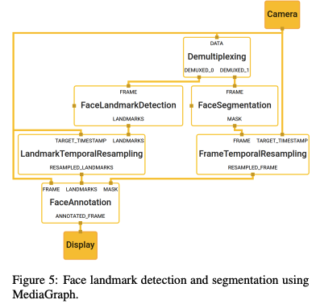

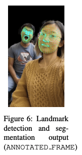

- **Gesture Recognition and Pose Estimation:** Most important to this discusion, MediaPipe facilitates the development of real-time solutions for detecting hand gestures or human poses. It allows you to more easily leverage modular pipelines for precise processing of video.

---

# MediaPipe Hands: On-device Real-time Hand Tracking

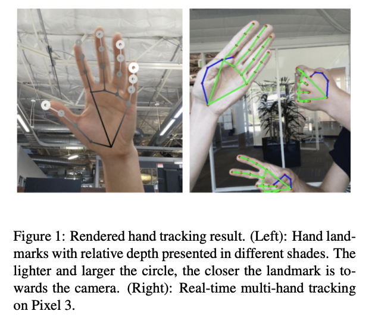

## Motivation

Building on the previous paper on MediaPipe, this paper tackles the challenge of real-time, on-device hand pose estimation using a single RGB camera, a task critical for applications in augmented reality (AR) and virtual reality (VR). Existing methods either depend on specialized hardware, such as depth sensors, or are too computationally intensive for mobile devices. The primary goal is to deliver an efficient, lightweight hand tracking solution operable across diverse platforms, including mobile phones and desktops.

## Methodology

The architecture consists of two models: 

### **BlazePalm Detector: Simplified Palm Localization**

The BlazePalm Detector introduces an innovative approach to mobile palm detection through its single-shot architecture. Rather than attempting to model the full complexity of articulated hands, the detector focuses on palm regions as rigid objects. This simplification effectively overcomes difficulties such s significant size variations, extreme scale differences spanning approximately 20x, and occlusion.

By adopting square bounding boxes for palm representation, the detector achieves substantial reductions in anchor complexity - typically by a factor of three to five compared to traditional approaches. This representation enhances Non-Maximum Suppression (NMS) performance, particularly in cases of self-occlusion where multiple palm detections might otherwise interfere.

An encoder-decoder structure is built for scene context integration helpful to detect small palms. 

Focal loss optimization supports the extensive anchor set necessary for reliable detection, and in turn, helps address the challenge of variance differences.

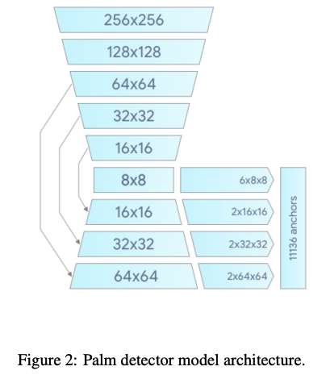

### Hand Landmark Model: Precise Hand Pose Localization

The Hand Landmark Model generates precise coordinates for 21 key points within detected palm regions. This 2.5D coordinate system encompasses x and y positional data alongside relative depth information. The paper shows this helps maintain robust performance even with partial occlusion or limited visibility.

The model's output encompasses three components: the spatial coordinates of 21 hand landmarks with relative depth information, a confidence metric indicating hand presence probability, and a binary classification distinguishing between left and right hands. 

For 2D coordinate prediction, the paper relies on real-world datasets, while for relative depth estimation, the paper relies on synthetic training data. For continuous/real-time operation, there is an intelligent reset mechanism, triggering redetection when alignment confidence falls beneath specified thresholds.

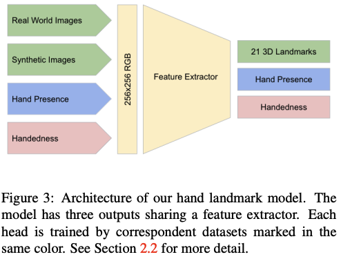

## Datasets

As stated, the paper uses both real and synthetic data.

The in-the-wild dataset, comprising 6,000 images, captures natural hand appearances across diverse environmental conditions, lighting scenarios, and geographical contexts. However, there is a limited range of hand articulations.

To address this limitation, the in-house gesture dataset introduces 10,000 images featuring varied hand poses and viewing angles. The paper showed this significantly enhances the model's ability to handle diverse hand configurations despite only 30 participants.

The synthetic dataset contains 100,000 images from a sophisticated 3D hand model. This model incorporates 24 bones, 36 blendshapes, and 5 distinct skin tones, rendered under varied lighting conditions and camera perspectives. 

The training strategy employs these datasets selectively: palm detection relies exclusively on the in-the-wild dataset to ensure robust appearance handling, while the hand landmark model leverages all three datasets. The annotation process includes 21 landmark positions for real images, projected 3D joint positions for synthetic data, and specific labeling for hand presence and handedness classification. This structured approach enables the model to learn from both natural variation and synthetically generated complexity.​​​​​​​​​​​​​​​​

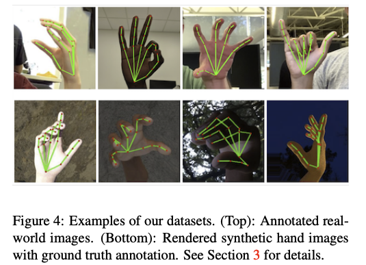

## Results

The performance evaluation of the hand tracking system reveals compelling quantitative and qualitative results. The models leveraging combined datasets demonstrated superior accuracy, achieving a normalized Mean Squared Error of 13.4%. This represents a significant improvement over models trained exclusively on real data (16.1% MSE) or synthetic data (25.7% MSE), underscoring the effectiveness of the hybrid training approach.

The "Full" model configuration achieved an optimal balance between accuracy and computational efficiency, recording an MSE of 10.05 while maintaining real-time performance with a latency of 16.1 milliseconds per frame on Pixel 3 hardware. This performance metric validates the model's suitability for mobile applications requiring both precision and responsiveness.

Qualitative analysis demonstrates the system's robust performance even when there is partial occlusion and diverse skin tones. Synthetic training data substantially reduced visual jitter in landmark predictions.

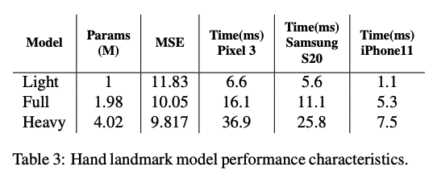

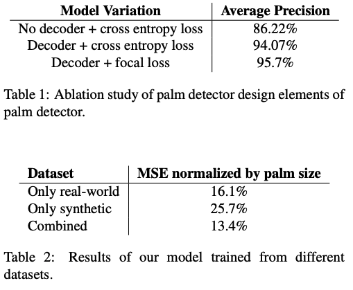

---

# HMP: Hand Motion Priors for Pose and Shape Estimation from Video

## Motivation

Some for pose estimation models in general, in reconstructing 3D hand poses and shapes from RGB videos, come from the fact that hands have a lot of specific joints and are often occluded, either by objects or themselves, and can move quickly. Some methods rely on single-frame inputs, which makes it hard to maintain temporal consistency, which leads to problems like jittery results, missing predictions, or noisy reconstructions. Video-based approaches can use temporal information to improve stability, but they are often held back by limited diversity in existing datasets, making it hard to apply the extra temporal and motion information gained from video to real world situations. The paper introduces Hand Motion Priors (HMP), which is a generative motion prior specific to hands that leverages large-scale motion capture datasets.

## Methodology

This system uses a hand model called MANO to describe the hand's 3D motion and shape via its global position, rotation, finger movements, and overall hand structure. This method uses insights from motion capture datasets to improve accuracy in estimating hand motions.

### **1. Hand Motion Prior**

During training, a variational autoencoder (VAE) is used to learn natural hand motion patterns. The VAE is made of two main parts. The first is an encoder which compresses the observed hand motion from the AMASS dataset into a compact latent representation. The second part of the VAE is a decoder, which reconstructs the motion from this latent representation. The decoder is designed to process entire motion sequences in parallel, making it highly efficient for long videos. This is being used to gain the information to optimize hand motion later on down the line. The authors of the paper chose to use a non-autoregressive model for their VAE because of the fact that it allows for parallel computation, which significantly reduces the processing time but maintains accuracy. The VAE learns to map plausible hand movements into the latent space, effectively capturing the underlying patterns of natural hand motions. This approach helps restrict motion estimates to realistic movements based on prior knowledge while ensuring computational efficiency. The loss used is the decoder’s reconstruction loss along with KL divergence.

### **2. Initialization**

During testing, the system first detects the hands in each video frame and estimates the hand's initial 3D position and shape using a pre-trained model. If the tracker fails (for example, due to occlusion), it fills in the gaps by interpolating motion smoothly between frames. It combines keypoint data from two different systems (MediaPipe, discussed previously, and PyMAF-X) to create a stronger, more reliable starting point. From here, it moves to the next step which actually uses the VAE from step 1.

### **3. Latent Optimization**

The main innovation is done here. The system improves initial estimates by optimizing them using a set of rules and constraints. Primarily, the system focuses on keeping position and shape guesses close to the initial guesses, ensuring movements are smooth and consistent, and of course incorporating the learned hand motion prior to favor natural-looking hand motions.

The optimization process minimizes a combination of loss functions, and all of these are working together during the optimization step in order to tune the final position and pose of the hand to be the most accurate and realistic it can be. The losses it uses are:

- **Global Orientation Loss**: Ensures the hand’s rotation remains consistent with the initial estimate.
- **Global Translation Loss**: Encourages the hand’s position to align with the initial position.
- **Shape Regularization Loss**: Keeps the shape parameters close to zero, favoring natural hand shapes.
- **Smoothness Losses**: Enforces smooth transitions in global orientation and translation over time.
- **2D Keypoint Loss**: Aligns the 3D hand motion with 2D keypoints detected in the video.
- **Motion Prior Loss**: Ensures the estimated motion aligns with the learned hand motion prior.

Optimization happens in two stages:

1. Coarse adjustments of global hand properties like position and rotation.
2. Refinements using the motion prior to adjust detailed finger poses.

For occluded frames where tracking fails, the system uses information from visible frames to predict plausible hand motions. The method also works in parallel on long sequences, making it faster than older approaches.

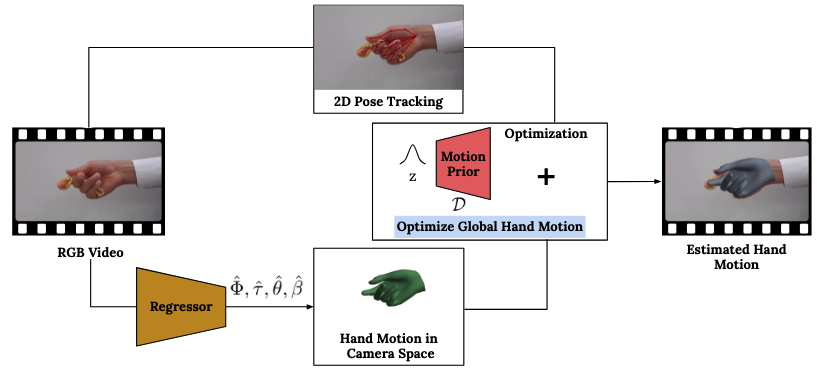

## Results

As can seen from the table, the hand motion priors optimization makes improvements to all models on both tested datasets. The HO3D-v3 and DexYCB datasets are both datasets involving multiple individuals interacting with multiple objects, with a variety of settings and poses, including some occlusion. There are three error types measured. PA-MPJPE measures how accurately the predicted hand shape matches the ground truth after aligning their scales and orientations. RA-MPJPE evaluates the accuracy of the predicted joint positions relative to the root of the hand. RA-ACC assesses how smooth and consistent the predicted hand motion is over time compared to the ground truth.

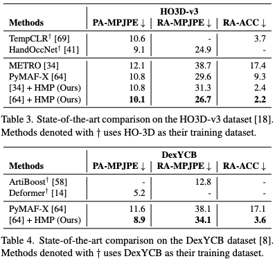

# Technical Demo

With the speed and accuracy of MediaPipe Hands, we decided to implement a proof-of-concept model using Hands and a temporal model to evaluate FMA tests related to hands using a camera set up and no external sensors.

To collect data for the experiment, we collaborated with the UCLA Bionics Lab. We invited multiple recovering stroke patients and filmed their hand as they attempted to complete the FMA upper extremity test of “Mass Finger Flexion.” A physician with them assigned a score of 0, 1, or 2 according to their performance, with 0 indicating impaired and 2 indicating normal motor performance.  

In total, we collected 90 trial videos of this test with scores in all categories.

On a high level, our model architecture was set up as follows:

1. We collected a video of a patient’s hand performing the test.
2. We used Mediapipe Hands to extract data on the hand angles on every frame.
3. We used interpolation to normalize each video’s data to 200 timepoints. Our dataset consisted of 90 examples, each with 1 label (0, 1, 2) and 200 timepoints. Each timepoint consisted of ~140 MediaPipe features. 
4. As evaluation of the stroke patient’s performance required an analysis of the temporal sequence  of hand features, we trained an RNN on this data.

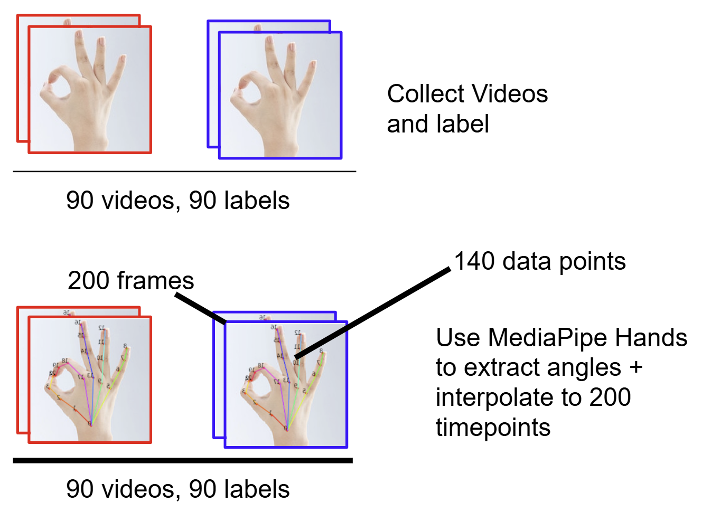

To train the RNN, we used a five-fold cross validation setup to tune hyperparameters such as laerning rate, 30 epochs per fold, and a 20% test dataset. The final test accuracy achieved was 100%.

Training Curve

### Codebase

[https://colab.research.google.com/drive/1jCPLKCuzR-gRZzUf6bIY0l-6IIgvCO8u#scrollTo=z2vmxWXkj71d](https://colab.research.google.com/drive/1jCPLKCuzR-gRZzUf6bIY0l-6IIgvCO8u#scrollTo=z2vmxWXkj71d)

### Limitations and conclusions

The limitation to our proof of concept is the small amount of data and its applicability to only hand exams. But given the ability to perform accurately with little equipment setup (just a camera), we’d like to explore this further by collecting more data on hand motions or exploring human pose estimation as a method of automating other FMA tests that do not involve hands.

# Conclusion

The reviewed papers address challenges in hand pose estimation such as real-time performance, robustness to scenarios such as occlusions, temporal analysis, and more. MediaPipe introduces a modular foundation for perception pipelines. MediaPipe Hands creates an efficient real-timehand tracking pipeline. HMP (Hand Motion Priors) uses robust motion priors that achieve temporal consistency.

Our application of MediaPipe Hands to the FMA test show there is potential to use temporally-consistent pose estimation methods in analysing stroke patient recovery and developing personalized treatment plans.

---

## References

- Lugaresi, C., Tang, J., Nash, H., McClanahan, C., Uboweja, E., Hays, M., Zhang, F., Chang, C., Guang Yong, M., Lee, J., Chang, W., Hua, W., Georg, M., & Grundmann, M. (2019). *MediaPipe: A framework for building perception pipelines*. arXiv. https://doi.org/10.48550/arXiv.1906.08172
- Zhang, F., Bazarevsky, V., Vakunov, A., Tkachenka, A., Sung, G., Chang, C., & Grundmann, M. (2020). *MediaPipe Hands: On-device real-time hand tracking*. arXiv. https://doi.org/10.48550/arXiv.2006.10214
- Duran, E., Kocabas, M., Choutas, V., Fan, Z., & Black, M. J. (2023). *HMP: Hand motion priors for pose and shape estimation from video*. arXiv. https://doi.org/10.48550/arXiv.2312.16737